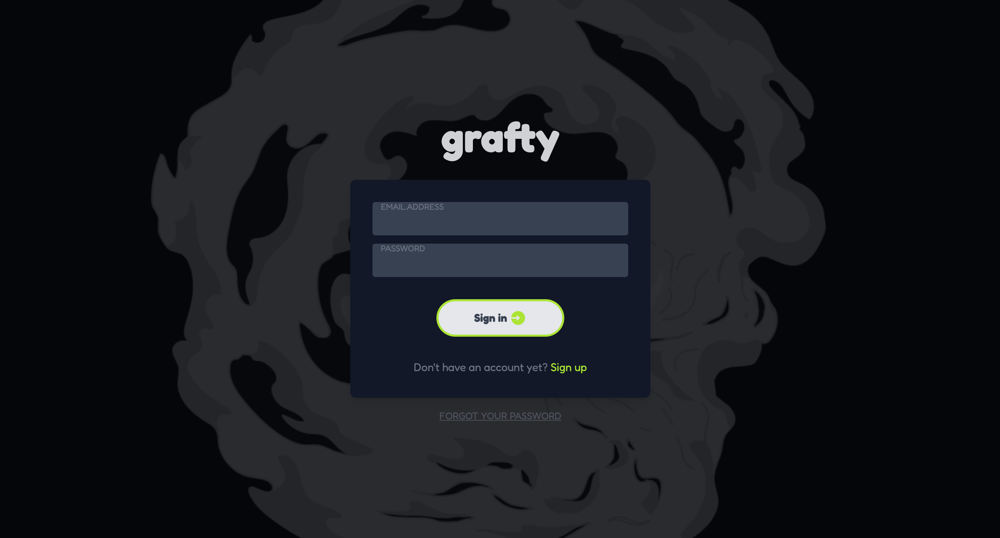
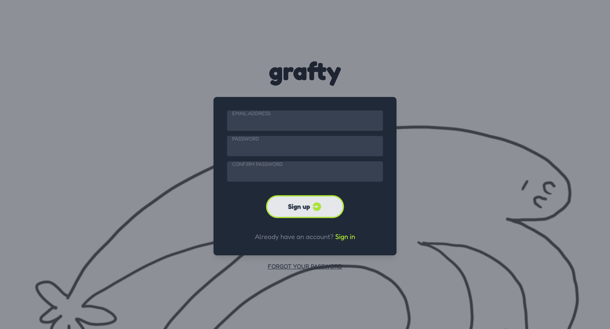
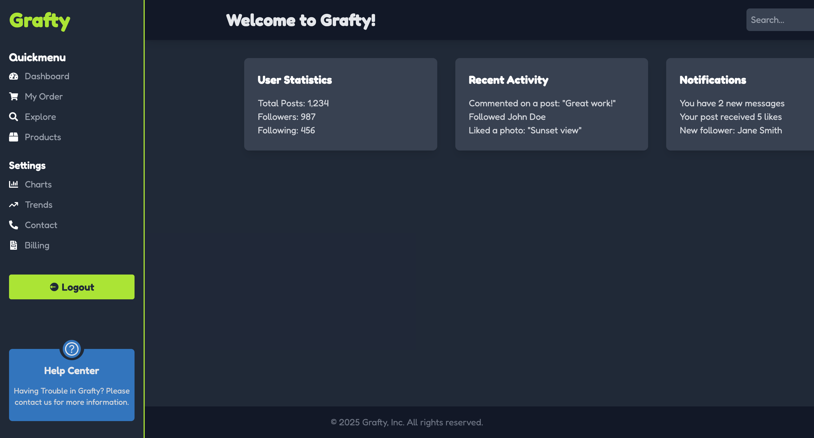

# Login-Dashboard WebApp React.js Node.js 
# FrontEnd

## Overview
Grafty Dashboard is a modern web application designed for managing user authentication and user statistics. The project is built using **React.js** and **Tailwind CSS** for the frontend, while the backend will be developed with **Node.js** and **MySQL**.  

Currently, the frontend development is **completed**, and backend integration is **planned**.  

## Features
###  Frontend
- **Login Page**: Users can authenticate by entering their credentials.
- **Register Page**: New users can create an account.
- **Dashboard**: Displays user statistics, recent activity, and notifications.

## Pages

### 1. Login Page
Users can log in using their email and password.



### 2. Register Page
New users can sign up by entering their details.



### 3. Dashboard (Frontend Only)
Displays user statistics, recent activity, and notifications.


## Installation

### Frontend Setup
```bash
# Clone the repository
git clone https://github.com/meso1007/React-Node-LoginForm-FrontEnd


# Install dependencies
npm install

# Run the frontend
npm run dev
```


## Technologies Used
### Frontend:
- **React.js** – Component-based UI framework.
- **Tailwind CSS** – Utility-first CSS framework.
- **React Icons** – Icon library for UI components.

## Future Plans
- **Backend Development** – Implement user authentication and database storage.
- **User Profiles** – Allow users to edit their profiles.
- **Dark Mode** – Add theme switching feature.
- **Admin Panel** – Role-based access control for different users.

## Contributing
Feel free to fork the repository, make improvements, and submit a pull request.

## License
This project is licensed under the MIT License.

## Contact
If you have any questions or suggestions, feel free to reach out via email: **[diegoshoya2017@gmail.com]**

# React-Node-LoginForm-FrontEnd

